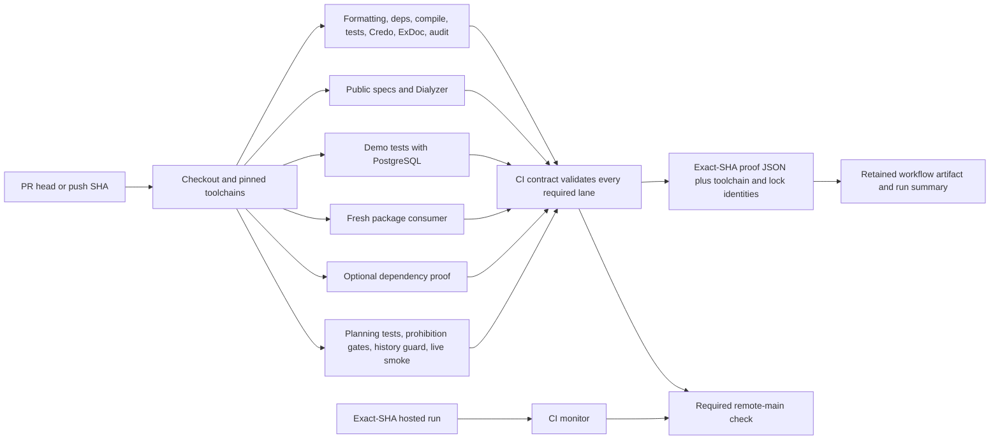

# Phase 33: Deterministic Green CI - Research

**Researched:** 2026-09-23
**Domain:** GitHub Actions CI for an Elixir SDK, exact-SHA proof, and CI performance
**Confidence:** HIGH for repository state; MEDIUM for official GitHub/Credo documentation; LOW for hosted-state and timing because the GitHub API was unreachable.

**Planning basis:** On 2026-09-24, the maintainer chose to continue from the committed roadmap and Phase 31 UAT rather than create phase-local context first. This is the planning source decision; it does not add or override product requirements.

## User Constraints

No Phase 33 `CONTEXT.md` exists, so there are no phase-local locked decisions to copy. The committed requirements are CI-01 through CI-05. Project GSD preferences require automation-first verification, high signal per runtime, and keeping hosted results separate from local evidence. In particular, preferences say: “aim to eliminate manual UAT where deterministic tests, contract checks, MockServer scenarios, downstream/demo smoke tests, or CI can prove behavior reliably”; “choose tests and CI checks for distinct risk reduction”; and “Measure CI cost and streamline redundant or low-value checks without removing required proof.” [VERIFIED: `.planning/GSD-PREFERENCES.md`]

## Phase Requirements

| ID | Description | Research Support |
|----|-------------|------------------|
| CI-01 | Every proposed change runs the complete required proof contract: formatting, dependency checks, warnings, tests, public specs, Dialyzer, Credo, ExDoc, vulnerability audit, demo/PostgreSQL, package smoke, optional-dependency proof, and planning guards. | Existing lanes cover every named item except Credo, ExDoc, and vulnerability audit; planning-truth now covers Phase 31 regressions. Add each missing lane to the stable aggregate and test the required set. |
| CI-02 | CI uses reviewed immutable inputs, controlled runners and toolchains, runtime-aware caches, explicit timeouts, and least-privilege permissions. | Current Actions are SHA-pinned in CI, but runner/container/tool installer inputs are not fully controlled; build-cache keys omit BEAM toolchain identity; no job declares `timeout-minutes`. |
| CI-03 | Maintainer can see measured CI critical-path evidence and a baseline-derived feedback target; speed improvements cannot remove required proof. | There is no hosted duration observation available in this session. Capture per-job duration and critical path before selecting a target; keep the required lane set explicit while optimizing setup/caches. |
| CI-04 | Remote `main` is protected by a stable aggregate check proving the exact commit SHA, and current main has recorded hosted-green evidence. | Workflow defines the `CI contract` aggregate and `scripts/ci_monitor.cjs` validates exact-SHA evidence, but branch protection and current-main hosted results are external state and could not be queried. |
| CI-05 | Every authoritative CI run produces a durable proof summary containing SHA, run identity, toolchains, lockfile identity, and each required lane's outcome. | Aggregate creates a local JSON file with SHA, workflow/run/attempt, lane IDs/results, and verified flag, but does not upload/persist it and omits toolchain and lockfile identity. |

## Summary

The repository already has a broad parallel GitHub Actions workflow. Its required `CI contract` job currently aggregates root Mix tests, static analysis, demo/PostgreSQL, package smoke, optional-dependency proof, and planning-truth. The planning-truth lane is now substantial: it fetches/asserts historical refs, derives a base/head range, runs all Node and prohibition tests, checks Phase 31 prohibition descriptors, runs the append-only history guard, and smokes live planning health. Those changes directly address the six Phase 31 UAT/debug diagnoses; preserve those artifacts as historical evidence and do not rewrite their recorded outcomes. [VERIFIED: `.github/workflows/ci.yml:21-359`; `.planning/phases/31-repository-planning-truth/31-UAT.md`; `.planning/debug/phase-31-inventory-report-only-automation.md`; `.planning/debug/phase-31-ownership-incompleteness-automation.md`; `.planning/debug/phase-31-authority-chain-automation.md`; `.planning/debug/phase-31-inert-repairs-conflicts-automation.md`; `.planning/debug/phase-31-frozen-history-additive-corrections-automation.md`; `.planning/debug/phase-31-independent-milestone-identity-automation.md`]

Phase 33 should close the named gaps without redoing Phase 31: run the required Credo lint, ExDoc build, and Hex audit checks; make runtime/tool inputs and cache boundaries explicit; add explicit per-job timeouts; measure hosted critical-path timing; retain a machine-readable proof artifact with exact SHA, run identity, toolchains, lock identities, and every lane result; and reconcile the aggregate with remote main's required-check setting and an exact-SHA hosted run. Use static contract tests for workflow/job completeness and proof schema. No implementation or broad tests were run for this research.

**Primary recommendation:** Keep the existing parallel lanes and stable `CI contract`; add the missing proof lanes, tighten input/cache/timeout declarations, and upload a complete summary artifact. Establish feedback targets only from hosted duration measurements.

## Architectural Responsibility Map

| Capability | Primary Tier | Secondary Tier | Rationale |
|------------|-------------|----------------|-----------|
| Per-change quality and security proof | CI jobs | Mix task/test suites | CI schedules the complete required contract; Mix and Node remain the test/check owners. |
| Exact-SHA aggregation | GitHub Actions `CI contract` job | `scripts/ci_monitor.cjs` | Workflow job results define green; the monitor independently checks a hosted run against the requested SHA and named lanes. |
| Durable proof and timing | GitHub Actions workflow artifacts/run summary | `scripts/ci_monitor.cjs` | Workflow has run identity and lane results; persisted JSON and job timing make results inspectable after job exit. |
| Remote-main enforcement | GitHub branch ruleset/protection | Stable `CI contract` job | The repository defines the check name, but only the hosted repository setting can require it. |
| Application/runtime behavior | Mix tests and demo | CI runners | Existing SDK/demo code remains responsible for runtime behavior; CI should not duplicate SDK behavior in custom scripts. |

## Standard Stack

### Core

| Library | Version | Purpose | Why Standard |
|---------|---------|---------|--------------|
| Elixir / Erlang OTP / Node.js | Project-pinned values are verbatim: `erlang 28.1`, `elixir 1.19.5-otp-28`, `nodejs 22.14.0`. [VERIFIED: `.tool-versions:1-3`] | SDK and demo checks; Node planning/prohibition checks. | The workflow configures the BEAM using `.tool-versions` in strict mode; Node is already used by the planning guard suite. |
| GitHub Actions | Existing workflow uses `ubuntu-latest`, sets workflow permissions to `contents: read`, and contains a stable `CI contract` job. Exact source values: `runs-on: ubuntu-latest`, `permissions:`, `contents: read`, `ci-contract:`, `name: CI contract`. [VERIFIED: `.github/workflows/ci.yml:6-24`; `.github/workflows/ci.yml:315-359`] | Run, aggregate, and retain proof for changes. | Already the authoritative CI surface named by CI-01..05. GitHub documents jobs run in parallel by default and `needs` creates dependency order. [CITED: https://docs.github.com/en/actions/reference/workflows-and-actions/workflow-syntax] |
| Credo | Official installation docs currently show `{:credo, "~> 1.7", only: [:dev, :test], runtime: false}`. [CITED: https://credo.hexdocs.pm/installation.html] Current Hex registry version was not observed in this session. | Elixir lint required by CI-01. | Credo's official installation guide specifies the Mix dependency and dev/test-only, non-runtime setup. Add only after confirming/pinning the current desired Hex release. |
| ExDoc | Existing project dependency constraint is verbatim `{:ex_doc, "~> 0.34", only: :dev, runtime: false}`. [VERIFIED: `mix.exs:42-46`] | Build public project documentation. | Project already declares ExDoc; CI can run `mix docs` without introducing another package. |

### Supporting

| Library/tool | Version | Purpose | When to Use |
|--------------|---------|---------|-------------|
| Hex audit Mix task | Existing local Phase 32 acceptance invokes `mix hex.audit`. [VERIFIED: `bin/phase32_compatibility.sh:389-415`] | Vulnerability audit required by CI-01. | Add to required CI; keep registry/network failure distinct from clean advisory results. |
| Node built-in test runner | Project Node version in `.tool-versions`: `nodejs 22.14.0`. [VERIFIED: `.tool-versions:3`] | Workflow contract, CI monitor, planning truth, history guard, prohibition tests. | Run the already-existing `scripts/*.test.cjs` and `scripts/prohibitions/*.test.cjs` suite in the planning-truth lane. |
| Actions cache | Existing action references are full commit SHAs with readable release comments, e.g. `actions/cache@0057852bfaa89a56745cba8c7296529d2fc39830 # v4.3.0`. [VERIFIED: `.github/workflows/ci.yml:33-39`] | Restore dependencies/build outputs and Dialyzer PLTs. | Retain only where hosted timing shows a benefit; key compiled state by runner OS/architecture, OTP, Elixir, Mix environment, and lockfile identity as applicable. GitHub warns cache contents are unsigned and can affect subsequently executed files. [CITED: https://docs.github.com/en/actions/reference/workflows-and-actions/dependency-caching] |
| Workflow artifact action | Version/pin to be selected when implementing. | Retain proof JSON and optional compact timing summary for each run. | Use for durable post-job evidence. GitHub documents artifacts persist produced files after a job completes; deleting a workflow run also deletes its artifacts. [CITED: https://docs.github.com/en/actions/concepts/workflows-and-actions/workflow-artifacts] |

### Alternatives Considered

| Instead of | Could Use | Tradeoff |
|------------|-----------|----------|
| Adding Credo as project Mix dev/test tooling | Run Credo from an ephemeral `Mix.install` or separate lint container | A separate runtime adds another package-resolution path and reduces consistency with project configuration; the official Credo guide documents the Mix dependency approach. The dependency's current Hex release still needs registry confirmation. |
| Retained workflow artifact as proof | Console log only | Logs are useful for diagnosis but the CI-05 proof should be a directly downloadable, structured run artifact; keep exact-SHA run URL too. |
| Fixed feedback target selected now | Derive target from measured hosted baseline | A target invented without observed runtimes could reward dropping checks or be impossible on cold caches. Measure first, then set a documented percentile/threshold. |

**Installation:** No external package was installed. If implementing the required Credo lane, use the official Mix setup pattern in the Credo documentation, confirm the selected release against Hex when network access is available, update `mix.lock`, then run `mix credo` in the CI contract. Credo installation docs say add as `only: [:dev, :test], runtime: false` and run `mix deps.get`. [CITED: https://credo.hexdocs.pm/installation.html]

## Package Legitimacy Audit

| Package | Registry | Age | Downloads | Source Repo | Verdict | Disposition |
|---------|----------|-----|-----------|-------------|---------|-------------|
| `credo` | Hex | Not observed | Not observed | Official docs link to Hex package; repository metadata not independently checked | Unobserved | Required by CI-01; verify current Hex release and package identity before pinning |

The package-legitimacy seam only accepts `npm`, `pypi`, or `crates`; a Hex query returns a usage error. `mix hex.info credo` was attempted, but Hex DNS resolution failed. Therefore registry age/download/source-repo data and current version are unknown, not negative. Credo's official documentation is available and gives the Mix setup pattern. [CITED: https://credo.hexdocs.pm/installation.html]

**Packages removed due to [SLOP] verdict:** none.
**Packages flagged as suspicious [SUS]:** none. The Hex registry legitimacy result is unavailable; do not misstate it as `OK` or `SUS`.

## Architecture Patterns

### System Architecture Diagram



The existing workflow implements the parallel lanes and aggregate. The missing durability step is that `ci-contract-proof.json` is written in the `CI contract` runner and printed, but no artifact upload step persists it. [VERIFIED: `.github/workflows/ci.yml:315-359`]

### Recommended Project Structure

```text
.github/workflows/
└── ci.yml                         # required workflow, lane timeouts, aggregate, proof artifact
scripts/
├── ci_monitor.cjs                 # exact-SHA hosted evidence check
├── ci_monitor.test.cjs            # monitor job-name/SHA/result contract tests
├── history_integrity.cjs          # base-to-head planning history guard
├── planning_health.cjs             # live planning health smoke target
└── prohibitions/                   # Phase 31 fail-first automated checks
bin/
└── package_smoke.sh                # fresh package consumer proof
```

Existing source ownership is visible in `.github/workflows/ci.yml`, `scripts/ci_monitor.cjs`, `scripts/history_integrity.cjs`, `scripts/planning_health.cjs`, `scripts/prohibitions/enforce_phase31.cjs`, and `bin/package_smoke.sh`. [VERIFIED: cited source files]

### Pattern 1: Required proof lanes with one aggregate

**What:** Run independent suites as parallel jobs, then use one always-running aggregate job to reject any missing, skipped, or non-success result. Keep its displayed check name stable for branch protection and keep the monitor's required job-name list aligned.
**When to use:** Every PR and main push must receive one required result for the exact event SHA.
**Example:** Existing aggregate source has `needs:`, `if: ${{ always() }}`, and the exact job IDs `test`, `dialyzer`, `demo-postgres`, `package-smoke`, `optional-deps`, and `planning-truth`; the monitor's exact names are `mix test`, `static analysis`, `demo PostgreSQL`, `package smoke`, `optional dependencies`, `planning truth`, and `CI contract`. [VERIFIED: `.github/workflows/ci.yml:315-359`; `scripts/ci_monitor.cjs:5-13`]

### Pattern 2: Exact-SHA, durable proof summary

**What:** Generate a compact JSON summary that binds event SHA and run identity to each required lane, selected toolchain versions, lockfile digests, and conclusion. Upload it as a run artifact and include a human-readable summary link. Preserve failed-run summaries too, so diagnostics survive job teardown.
**When to use:** CI-05 evidence and exact-SHA maintainer review.
**Example fields:** Existing file uses `sha`, `workflow`, `run_id`, `run_attempt`, `required_jobs`, and `verified`. Add toolchain, lockfile-identity, event/ref, lane timestamps/durations, and artifact digest fields. [VERIFIED: `.github/workflows/ci.yml:329-356`; `.planning/REQUIREMENTS.md:49-50`]

GitHub Actions documents `permissions` at workflow/job scope and recommends minimum token permission; jobs run in parallel by default; workflow artifacts persist files after the producing job completes. [CITED: https://docs.github.com/en/actions/reference/workflows-and-actions/workflow-syntax; https://docs.github.com/en/actions/concepts/workflows-and-actions/workflow-artifacts]

### Anti-Patterns to Avoid

- **Selecting newest CI run by branch:** `scripts/ci_monitor.cjs` already queries by commit and explicitly requires `headSha === sha`; retain exact-SHA semantics. [VERIFIED: `scripts/ci_monitor.cjs:136-155`]
- **Making performance improvements by deleting lanes:** CI-01 explicitly requires the full proof set; optimize duplicated setup, scheduling, or safe caches instead.
- **Treating a clean checkout as hosted proof:** local test success cannot prove branch protection or remote main's exact-SHA result.
- **Treating cache contents as trusted:** GitHub warns restored cache contents can alter files later executed by a workflow; keep cache writes on trusted runs and separate caches by runtime/environment. [CITED: https://docs.github.com/en/actions/reference/workflows-and-actions/dependency-caching]
- **Treating workflow-generated JSON as durable:** a runner-local file disappears when the job ends unless uploaded as an artifact or otherwise persisted.

## Don't Hand-Roll

| Problem | Don't Build | Use Instead | Why |
|---------|-------------|-------------|-----|
| Elixir lint rules | Custom ad-hoc source scanner | Credo Mix task | Credo is explicitly required by CI-01 and supplies Elixir-aware checks. |
| CI workflow proof storage | Custom GitHub API upload/persistence protocol | GitHub Actions workflow artifacts | Native artifacts retain run outputs after jobs finish and provide run association. [CITED: https://docs.github.com/en/actions/concepts/workflows-and-actions/workflow-artifacts] |
| Hosted exact-SHA lookup | Branch-name/newest-run resolver | Existing `scripts/ci_monitor.cjs` exact-SHA workflow and job checks | It already rejects missing runs, wrong SHA, missing jobs, failed/cancelled jobs, and non-success run conclusions. [VERIFIED: `scripts/ci_monitor.cjs:136-155`; `scripts/ci_monitor.cjs:299-331`] |
| Planning history immutability | A current-worktree diff only | Existing `scripts/history_integrity.cjs --base ... --head ...` | Phase 31 diagnosed that current-state diffs miss already-committed rewrites; the current workflow derives explicit base/head Git objects. [VERIFIED: `.github/workflows/ci.yml:262-313`; `scripts/history_integrity.cjs`] |

**Key insight:** CI trust requires three distinct pieces: behavior checks, a required aggregate bound to the exact SHA, and durable evidence. The repository now has the first two for current lanes; the proof artifact and remote repository setting are not established by the workflow file alone.

## Common Pitfalls

### Pitfall 1: “Complete CI” omits an explicit requirement lane

**What goes wrong:** A passing aggregate does not mean Credo, ExDoc, or Hex audit ran when those lanes are absent from its dependencies.
**Why it happens:** Existing broad test/static jobs create a false impression that every named proof is covered.
**How to avoid:** Treat CI-01's list as a contract matrix and test every required proof against both a workflow step and an aggregate dependency.
**Warning signs:** No `mix credo`, `mix docs`, or `mix hex.audit` under `.github/workflows/ci.yml`; these do appear in project dependency/config or Phase 32 local acceptance evidence. [VERIFIED: `.github/workflows/ci.yml`; `mix.exs:42-46`; `bin/phase32_compatibility.sh:409-415`]

### Pitfall 2: Reproducibility is weaker than dependency-locking

**What goes wrong:** The lockfile can be identical while runner images, database images, or fetched Hex/Rebar installers differ.
**Why it happens:** Floating runner labels and mutable container tags leave important tool inputs outside the lockfile.
**How to avoid:** Choose controlled runner/image/tool inputs and record resolved tool versions; pin images by digest where feasible. Preserve readable version comments beside immutable action SHAs. [VERIFIED: `.github/workflows/ci.yml:24-39`; `.github/workflows/ci.yml:125-145`; `.github/workflows/ci.yml:41-47`]
**Warning signs:** `runs-on: ubuntu-latest`, `image: postgres:17`, and `mix local.hex --force` / `mix local.rebar --force` are currently used. [VERIFIED: `.github/workflows/ci.yml:24`; `.github/workflows/ci.yml:125-138`; `.github/workflows/ci.yml:41-47`]

### Pitfall 3: Cache reuse crosses runtime boundaries

**What goes wrong:** Cached compiled output or dependency builds can be reused after BEAM/toolchain/environment changes, producing cache misses disguised as hits or stale build failures.
**Why it happens:** Root/demo caches are keyed by runner OS and lockfile but not explicitly by OTP/Elixir/Mix environment; the PLT cache already includes OTP, Elixir, and lock identity.
**How to avoid:** Use runtime-aware keys for build artifacts and separate root/demo/test/dev caches as needed. Verify safe reuse with timing and cold-cache runs; do not share compiled state across incompatible BEAMs.
**Warning signs:** Root cache key uses `${{ runner.os }}-library-${{ hashFiles('mix.lock') }}` while PLT key includes `${{ steps.setup-beam.outputs.otp-version }}` and `${{ steps.setup-beam.outputs.elixir-version }}`. [VERIFIED: `.github/workflows/ci.yml:33-39`; `.github/workflows/ci.yml:89-97`]

### Pitfall 4: No timeouts or fabricated feedback target

**What goes wrong:** Hung jobs consume CI minutes and obscure the expected PR feedback time, or an arbitrary target incentivizes deleting useful proof.
**Why it happens:** No current CI job sets `timeout-minutes`, and hosted timing could not be read in this session.
**How to avoid:** Add conservative explicit job timeouts based on observed lane duration plus headroom; record each job's elapsed time and derive an initial target from a representative hosted baseline before setting it.
**Warning signs:** No `timeout-minutes` occurrence in `.github/workflows/ci.yml`; no hosted durations were returned by GitHub API because it failed DNS resolution. [VERIFIED: `.github/workflows/ci.yml`; current `gh run list` attempt failed to connect to `api.github.com`]

### Pitfall 5: GitHub cache scope becomes a trust boundary

**What goes wrong:** Untrusted PR content can influence cache data later restored and executed by a trusted job.
**Why it happens:** Cache content is unsigned and can modify subsequently executed files.
**How to avoid:** Leave low-trust cache access read-only; allow trusted main/push workflows to refresh caches; never add secrets or generated proof artifacts to caches. [CITED: https://docs.github.com/en/actions/reference/workflows-and-actions/dependency-caching]
**Warning signs:** PR-triggered write-capable cache modes, broad cache restore prefixes, or sharing cache keys across jobs with different trust levels.

### Pitfall 6: Historical UAT evidence is erased or upgraded

**What goes wrong:** Prior reported UAT issues are rewritten as though they never existed, or a past local pass is relabeled as current hosted proof.
**Why it happens:** The current implementation changed after Phase 31's diagnosed gaps.
**How to avoid:** Keep the six debug diagnoses and Phase 31 UAT immutable; cite them as historical cause evidence, then use present workflow inspection and current exact-SHA runs for new claims. Preserve synthetic-only proof data and exclude personal/customer data from artifacts.
**Warning signs:** Editing old UAT/debug files to change issue status or copying historical run claims into a current CI summary.

## Code Examples

Verified existing task patterns; the plan should add the currently missing calls to a required job and require that job in the aggregate.

```bash
mix format --check-formatted
mix deps.unlock --check-unused
mix compile --warnings-as-errors
mix typecheck.specs
mix dialyzer
mix test
mix docs
mix hex.audit
mix credo
node --test scripts/*.test.cjs scripts/prohibitions/*.test.cjs
node scripts/prohibitions/enforce_phase31.cjs
node scripts/planning_health.cjs --json
```

The already-present commands are verbatim from `.github/workflows/ci.yml:49-64`, `.github/workflows/ci.yml:106-110`, and `.github/workflows/ci.yml:303-313`, plus Phase 32's recorded local acceptance command `mix hex.audit` at `bin/phase32_compatibility.sh:414`. The Credo setup and Mix task are documented by Credo's official installation guide. [CITED: https://credo.hexdocs.pm/installation.html]

## State of the Art

| Old Approach | Current Approach | When Changed | Impact |
|--------------|------------------|--------------|--------|
| Phase 31 behavioral proof only ran locally and preservation checked current state | Current workflow runs the full Node suite, six-prohibition enforcement, base-to-head history integrity, and live planning-health smoke in a required aggregate lane | Recorded in Phase 31 Plan 31-09 and current `.github/workflows/ci.yml`; exact historical change date from the current workflow was not separately inspected | Phase 31's six diagnosed causes have a recurring workflow proof path; preserve UAT/debug artifacts as historical evidence. [VERIFIED: `.github/workflows/ci.yml:234-313`; `.planning/phases/31-repository-planning-truth/31-09-SUMMARY.md`] |
| Print a CI proof JSON into job logs only | Persist a per-run artifact with complete exact-SHA, toolchain, lockfile, and lane evidence | Proposed for Phase 33 | Allows maintainers to inspect proof after the runner exits; GitHub artifacts persist job outputs but are deleted with their workflow run. [CITED: https://docs.github.com/en/actions/concepts/workflows-and-actions/workflow-artifacts] |
| Treat a branch green badge as candidate proof | Require the exact SHA and every expected job conclusion | Implemented in current monitor; remote enforcement still unobserved | Prevents branch-recency or missing-job shortcuts. [VERIFIED: `scripts/ci_monitor.cjs:136-155`; `scripts/ci_monitor.cjs:299-331`] |

**Deprecated/outdated:** None identified for the selected CI stack. Do not assume a green local run, or a workflow-defined check, proves that hosted `main` branch protection currently requires the check.

## Assumptions Log

| # | Claim | Section | Risk if Wrong |
|---|-------|---------|---------------|
| A1 | Credo's current desired Hex release can be pinned using the official `~> 1.7` installation pattern. | Standard Stack / Package Audit | Registry could be unavailable or version metadata could have changed; verify Hex release and identity before editing `mix.lock`. |
| A2 | A hosted-runner image digest or other controlled runner image can be selected without unacceptable maintenance burden. | Common Pitfalls | An overly restrictive image pin may create maintenance or availability cost; compare control versus upkeep. |
| A3 | An initial feedback target should be derived from representative hosted run samples (including cold-cache runs) before a threshold is locked. | CI-03 | A small or biased sample can set an unhelpful target. |

## Resolved Planning Questions

These are resolved as planning decisions. The corresponding hosted and registry facts remain **unobserved** until execution has authenticated network access; no plan treats absence of observation as success or failure.

1. **Hosted critical-path baseline and feedback target — resolved approach.** Capture representative complete-contract runs before performance edits; separate queue delay from execution, retain each lane's duration/cache state, derive critical path from required jobs plus aggregation, and set a documented target with percentile and headroom only after the sample is recorded. No numeric target is selected in advance.

2. **Remote `main` protection and current-main proof — resolved approach.** Inspect the hosted required-check ruleset and exact-SHA current-main run through authenticated GitHub APIs/CLI. Require the stable `CI contract` check and preserve SHA, run URL/attempt, artifact, and lane results. If hosted state cannot be queried, record it as unobserved and leave CI-04 incomplete; local workflow inspection is not a substitute.

3. **Controlled runner/tooling inputs — resolved approach.** Record actual runner and installed tool versions, then select reviewed immutable inputs and runtime-aware cache boundaries with bounded timeouts. Retain every CI-01 proof lane. Use hosted baseline measurements to judge cache/performance changes; do not add a version matrix without a supported-version requirement.

4. **Credo package and CI location — resolved approach.** Add Credo as the project dev/test, non-runtime dependency using the official integration pattern, but verify the package identity and selected release against Hex before pinning `mix.lock`. Run Credo in a required quality lane included in the stable aggregate. If Hex is unreachable, retain the blocker as unobserved rather than guessing a version.

## Environment Availability

| Dependency | Required By | Available | Version | Fallback |
|------------|------------|-----------|---------|----------|
| GitHub Actions / remote GitHub API | Hosted exact-SHA proof, ruleset check, timing baseline | ✗ — workflow config exists, but API query failed DNS | — | Local inspection can validate workflow wiring only; it cannot prove hosted state |
| Erlang / Elixir / Node toolchain | Existing Mix, demo, Node jobs | Version-file values observed: `erlang 28.1`, `elixir 1.19.5-otp-28`, `nodejs 22.14.0`; the local environment's installed versions were not probed | See verbatim pin | Hosted CI uses strict BEAM setup; local versions should be explicitly checked when planning validation |
| PostgreSQL | Demo integration lane | Configured as a hosted service; actual service startup not run in this research | `postgres:17` tag in workflow | No fallback required for authoritative demo/PostgreSQL proof |
| Hex registry | Dependency/security audit and Credo release confirmation | ✗ — `mix hex.info credo` failed DNS | — | Re-run registry lookups when network is available; do not call failed lookup “package absent” |

**Missing dependencies with no fallback:** Hosted GitHub read access is required to complete CI-03/CI-04 evidence; local workflow files cannot substitute.

**Missing dependencies with fallback:** None for implementation design; hosted state and Hex metadata require a later online observation.

## Validation Architecture

### Test Framework

| Property | Value |
|----------|-------|
| Framework | Elixir ExUnit and Node built-in `node:test`; project-pinned Node value is `nodejs 22.14.0`. [VERIFIED: `.tool-versions:3`] |
| Config file | `mix.exs` / `.formatter.exs`; built-in Node runner requires no config |
| Quick run command | `node --test scripts/ci_monitor.test.cjs scripts/prohibitions/enforce_phase31.test.cjs` [VERIFIED: `.planning/phases/31-repository-planning-truth/31-VALIDATION.md`] |
| Full CI workflow command | Defined as workflow jobs in `.github/workflows/ci.yml`; no single local command reproduces hosted remote-main proof |

### Phase Requirements → Test Map

| Req ID | Behavior | Test Type | Automated Command | File Exists? |
|--------|----------|-----------|-------------------|-------------|
| CI-01 | Every requirement lane exists and aggregate fails if a lane is missing, skipped, or failed | Static workflow contract + integration | `node --test scripts/ci_monitor.test.cjs` plus a workflow-contract test covering CI-01's entire lane list | ✅ monitor test exists; add/extend workflow contract coverage |
| CI-02 | SHA-pinned reviewed actions, explicit runner/tool versions, runtime-aware caches, job timeouts, least-privilege permissions | Static workflow contract | `node --test scripts/ci_monitor.test.cjs` plus new assertions for runner, cache, timeout, permissions, and action pin policy | ✅ monitor test exists; add/extend |
| CI-03 | Per-job and critical-path timing visible; feedback threshold comes from measured data | Workflow run metadata integration + timing contract | Test duration aggregation on fixture job timestamps; real baseline requires hosted Actions data | ❌ no timing summarizer or recorded timing baseline identified |
| CI-04 | Stable aggregate protects remote main and current-main exact SHA is green | Hosted integration/manual setup observation plus monitor unit tests | `node scripts/ci_monitor.cjs assert-ci --sha <exact-sha> --json`; hosted ruleset API check | ✅ monitor exists; hosted rule and SHA evidence unavailable here |
| CI-05 | Artifact contains SHA, run identity, toolchains, lock identity, and each lane outcome | Summary-schema unit test + workflow artifact smoke | Extend `scripts/ci_monitor.test.cjs`; validate uploaded artifact from a hosted run | ❌ artifact upload/schema for toolchain and lock identity not present |

### Sampling Rate

- **Per workflow-contract change:** Run focused `node --test scripts/ci_monitor.test.cjs` plus its new static workflow assertions.
- **Per CI lane change:** Run that lane's local equivalent where available; retain the full required hosted aggregate for authoritative proof.
- **Phase gate:** A hosted successful `CI contract` for the exact candidate SHA, downloadable proof artifact, verified remote-main required-check setting, and recorded timing baseline.

### Wave 0 Gaps

- [ ] Add workflow contract coverage for CI-01..CI-02 lane coverage, timeouts, runner/action/container/tool pins, cache key dimensions, and least privilege.
- [ ] Add proof-summary schema/timing tests for CI-03 and CI-05.
- [ ] Add artifact upload and hosted artifact retrieval/evidence check to a disposable PR run.
- [ ] Provision authorized GitHub read access for branch-rule and exact-SHA run checks; no credential should be added to ordinary PR CI.
- [ ] Confirm Credo against Hex and update the lockfile in the implementation phase.

## Security Domain

This phase changes CI control-plane security, not application authentication.

### Applicable ASVS Categories

| ASVS Category | Applies | Standard Control |
|---------------|---------|-----------------|
| V2 Authentication | No | No application identity flow changes. |
| V3 Session Management | No | No application session changes. |
| V4 Access Control | Yes | Explicit minimal workflow/job token permissions; PR CI remains without release secrets. GitHub supports permission scoping at workflow or job level. [CITED: https://docs.github.com/en/actions/reference/workflows-and-actions/workflow-syntax] |
| V5 Input Validation | Yes | Validate the workflow contract and proof summary against exact SHA, known required lane IDs, lock/toolchain fields, and bounded non-secret artifact data. |
| V6 Cryptography | No | Do not introduce custom signatures; use GitHub's artifact/run association and digest metadata if useful. Artifact attestations are out of the v2.2 commitment per REQUIREMENTS.md. |

### Known Threat Patterns for GitHub Actions CI

| Pattern | STRIDE | Standard Mitigation |
|---------|--------|---------------------|
| Mutable action, runner, or container inputs change code executed by CI | Tampering | Pin actions to reviewed full commit SHA; control runner/container/tool versions; verify updates in grouped PRs. |
| Untrusted PR workflow writes cache consumed by trusted run | Tampering / Elevation of Privilege | Keep low-trust cache access read-only; separate cache keys by trust/runtime; treat cache as executable untrusted data. [CITED: https://docs.github.com/en/actions/reference/workflows-and-actions/dependency-caching] |
| Broad token permission lets lint/test job modify repo or release | Elevation of Privilege | Keep `contents: read`; grant separate per-job read permissions only if evidence collection needs them; do not expose release key in CI. Current workflow has exact `contents: read`. [VERIFIED: `.github/workflows/ci.yml:14-15`] |
| Summary/artifact includes customer or personal data from test output | Information Disclosure | Limit artifact to synthetic CI metadata and bounded lane summaries; never copy raw logs, credentials, customer records, or private paths. |
| Skipped/cancelled job appears green due incomplete aggregate | Repudiation | `always()` aggregate must require every expected job result exactly `success`; the monitor must reject absent/mismatched SHA jobs. [VERIFIED: `.github/workflows/ci.yml:325-356`; `scripts/ci_monitor.cjs:299-331`] |

## Sources

### Primary (HIGH confidence)

- `.github/workflows/ci.yml` — Current triggers, tool install, lane inventory, planning-truth details, aggregate construction, permissions, caches, and absence of timeouts/artifact upload.
- `scripts/ci_monitor.cjs` and `scripts/ci_monitor.test.cjs` — Exact-SHA run/job checks and current evidence fields.
- `scripts/history_integrity.cjs`, `scripts/planning_health.cjs`, `scripts/prohibitions/enforce_phase31.cjs` — Current planning guard implementation.
- `.planning/phases/31-repository-planning-truth/31-UAT.md` and six `.planning/debug/phase-31-*.md` diagnoses — Historical requirement provenance; preserved and not rewritten.
- `.planning/phases/31-repository-planning-truth/31-VALIDATION.md` — Phase 31 automated proof commands and local runtimes/timing records.
- `.planning/GSD-PREFERENCES.md`, `.planning/REQUIREMENTS.md`, `.planning/ROADMAP.md` — Project constraints, CI requirements, and phase goal.

### Secondary (MEDIUM confidence)

- [GitHub Actions workflow syntax](https://docs.github.com/en/actions/reference/workflows-and-actions/workflow-syntax) — Token permission scope, job dependencies/parallelism, timeout configuration.
- [GitHub Actions dependency caching reference](https://docs.github.com/en/actions/reference/workflows-and-actions/dependency-caching) — Low-trust cache handling and unsigned-cache risks.
- [GitHub Actions workflow artifacts](https://docs.github.com/en/actions/concepts/workflows-and-actions/workflow-artifacts) — Run artifact persistence and association.
- [Credo installation guide](https://credo.hexdocs.pm/installation.html) — Mix dependency setup and compatible Elixir release guidance; the registry could not be independently queried in this session.

### Tertiary (LOW confidence)

- No tertiary sources used for recommendations.

## Metadata

**Confidence breakdown:**
- Standard stack: HIGH for existing toolchain/configuration values; MEDIUM for Credo setup from official docs; registry version is unobserved.
- Architecture: HIGH for checked-in workflow and script behavior; MEDIUM for GitHub-hosted artifact/permission behavior based on official docs.
- Pitfalls: HIGH for Phase 31 historical diagnosis and present source inspection; LOW for unobserved hosted timing/ruleset state.

**Research date:** 2026-09-23
**Valid until:** 2026-10-23 for repository structure; recheck hosted runner/action/toolchain and Credo registry state at planning/execution time.
