<user_constraints>
## User Constraints (from CONTEXT.md)

### Locked Decisions

## Implementation Decisions

### Recovery candidate authority

- **D-01:** Recovery accepts one existing versioned release tag (the repository's `vX.Y.Z` form) as its only candidate input. Resolve it to one commit SHA and derive the package version from the tag. Do not accept an arbitrary SHA or a second independently typed version; do not create a tag in the recovery path. Protect release tags against deletion or movement. Recovery retries an already-authorized release, rather than creating a second release-authoring interface. — **Reversibility:** costly — Supporting arbitrary commits later would add a second release-intent and tag/version reconciliation path.
- **D-02:** Automatic and recovery paths normalize to the same `{tag, peeled SHA, package name, package version}` identity tuple and run the same fail-closed gate. A tag mismatch, missing tag, unexpected package name/version, stale or incomplete proof, absent required job, or mismatched SHA stops before the Hex secret is available. Derive the expected Hex version from the tag and validate it against `mix.exs`; do not trust caller input or `github.ref` alone.

### Exact-SHA proof and package identity

- **D-03:** Reuse Phase 33's accepted full `CI contract` proof for the exact peeled release SHA, including its run/attempt and retained proof artifact identity. A release-specific subset rerun, a green run on another SHA, a branch-name lookup, local green results, or a historical CI artifact cannot substitute. Automatic release waits for the exact main commit's accepted complete contract; recovery looks up the same contract for its tagged SHA.
- **D-04:** Check the full identity chain: Release Please version and tag spelling; the tag's resolved commit; exact-SHA CI proof; the package name `oarlock` (distinct from Mix app `:paddle`); `mix.exs` package version; built package metadata/checksum; Hex release version/checksum; and the fetched Hex tarball. Run the supported `mix hex.publish --dry-run` checks before credentials. Keep the normal Mix/Hex publication interface and validate that the pre-publication package checksum can be compared reliably with Hex's published checksum and retrieved tarball. Do not introduce a custom `hex_core` publisher merely to achieve build-once semantics unless research proves the supported Mix path cannot establish SHIP-02; custom publication would increase maintenance and surprise for an Elixir package maintainer.
- **D-05:** After Hex reports publication, retrieve the Hex release metadata and package tarball, compare the registry checksum to the expected package checksum, unpack/validate package name and version, and compile it from a clean downstream Mix consumer. Treat a successful version endpoint alone as insufficient evidence of package-byte agreement or installability. Capture meaningful `mix hex.publish` warnings/output so automation does not hide Hex's package guidance.

### Serialization, secrets, and recovery semantics

- **D-06:** Both workflows use one shared `hex-publish` concurrency group for the external package publication, with queued attempts and no cancellation of an in-progress publisher. Use the largest supported queue (`queue: max`) and expose that GitHub's queue limit/order is not a release-order guarantee. Revalidate the tag, exact-SHA CI identity, version, and Hex version/checksum after lock acquisition. Never let the Release Please workflow's separate metadata concurrency group stand in for this shared Hex publish lock.
- **D-07:** A missing Hex version after a confirmed failed/absent upload may be retried after revalidation. If a prior ambiguous submission already exists with the expected version and matching package checksum, record idempotent success without republishing. If the version exists with a different checksum, stop and report a release incident with expected/observed values; never overwrite, revert, or silently advance the version. Human action is limited to resolving a genuine external registry conflict or selecting a new version.
- **D-08:** Keep the Hex credential out of CI and secret-free preflight. Use an expiring Hex organization API-write key in the final publication environment, scoped to the publish step; do not expose it to tests, CI proof retrieval, artifact inspection, dry-run, or post-publish verification. Keep GitHub permissions minimal per job: read for proof/preflight/publish unless release metadata or evidence upload specifically requires write. Use environment-level secret delivery so candidate checks complete before the publishing job can access the release secret. No routine human approval is required for checks the workflow can prove reproducibly.

### Durable evidence and maintainer ergonomics

- **D-09:** After Hex package and downstream consumer verification complete, generate and attach a compact, versioned `release-evidence.json` to the corresponding GitHub Release. Include repository identity, tag, peeled SHA, package name/version, accepted CI run URL and attempt, CI proof artifact ID/digest, release workflow run, dry-run outcome, expected package checksum, Hex release URL/checksum, fetched tarball verification, downstream compile result, timestamps, and caveats. Store links, identifiers, and digests rather than duplicating large logs, package contents, credentials, or customer data.
- **D-10:** Treat the per-release manifest as the durable maintainer/adopter index and Hex's served registry metadata and package as the authority for published bytes. The recovery path must create or update the associated GitHub Release as needed and attach the same record, using a separate least-privileged GitHub-write step with no Hex secret. Do not mark a GitHub Release immutable before the post-publish manifest is attached; protect version tags from moving/deletion instead. `.planning/EVIDENCE.md` documents the evidence authority/schema and carries Phase 34 acceptance proof, while release-specific facts live beside each GitHub Release. Existing Actions artifacts and logs remain supplemental diagnostics with finite retention and cannot be the only durable trace.
- **D-11:** Use concise, plain operator language and actionable fail-closed errors: name the check, expected identity, observed identity, relevant run/tag link, and safe next step. Do not expose release credentials or make maintainers decode backend logs to determine whether a package was published. Follow Oarlock's calm, precise, developer-native brand voice. No visual design system or frontend component work applies to this phase.

### the agent's Discretion

- Exact script/module boundaries, JSON schema field names, output formatting, bounded retry/poll intervals, and implementation language remain open if they preserve the locked release contract.
- Research/planning may select the Hex-supported checksum extraction commands/API and demonstrate deterministic checksum agreement with the standard Mix publisher before fixing command details.
- Keep GitHub artifact attestations and a custom package publisher deferred unless exact Hex-served package provenance cannot be proven adequately through supported Mix/Hex checks or concrete adopter demand justifies their maintenance cost.
- Automate all repeatable release verification at the earliest useful boundary and in CI when recurring risk reduction warrants runtime/maintenance cost. Human handoff is reserved for external registry conflicts or other irreducible judgment, with automated evidence and closure criteria recorded.

### Deferred Ideas (OUT OF SCOPE)

- Consumer-facing GitHub artifact attestations for package bytes and a custom canonical-tarball publisher — defer unless standard Mix publication cannot prove checksum agreement or concrete adopter demand supports the extra system.
- Creating release tags or choosing a new package version through the recovery workflow — belongs to release authoring and adds an unsafe second path.
- A release dashboard or frontend UI — out of scope; GitHub release surfaces and concise workflow output satisfy maintainer navigation for this phase.
</user_constraints>

<phase_requirements>
## Phase Requirements

| ID | Description | Research Support |
|----|-------------|------------------|
| SHIP-01 | Automatic and recovery publishing both fail before accessing release secrets unless the exact release SHA passed the complete required CI contract. [VERIFIED: .planning/REQUIREMENTS.md:59] | Reuse the Phase 33 exact-SHA gate and artifact identity; keep proof and preflight jobs outside the Hex environment; test failures for absent, stale, incomplete, and mismatched proof. |
| SHIP-02 | Release automation verifies agreement among source SHA, tag, package version, built artifact, and published package. [VERIFIED: .planning/REQUIREMENTS.md:60] | Normalize tag/peeled SHA/version/name; use supported `mix hex.build` and `mix hex.publish --dry-run`; compare outer tarball checksum to Hex release API checksum and fetched tarball, then unpack and compile as a consumer. |
| SHIP-03 | Publishing is serialized, least-privileged, and recovery follows the same quality and identity contract as automatic release. [VERIFIED: .planning/REQUIREMENTS.md:61] | Apply one shared publish-job concurrency group; isolate environment secret access to publish; use one tag-only recovery input and the common gate. |
| SHIP-04 | Maintainer can trace every release to durable evidence for its exact SHA, CI run, artifact, dry run, publication, and post-publish verification. [VERIFIED: .planning/REQUIREMENTS.md:62] | Attach a compact per-release evidence JSON after verification; treat Hex registry data/package as publication authority and planning evidence as the schema/acceptance ledger. |
</phase_requirements>

# Phase 34: Release Integrity - Research

**Researched:** 2026-09-25  
**Domain:** Elixir package publishing, GitHub Actions release security, artifact identity and durable release evidence  
**Confidence:** MEDIUM

## Summary

Phase 34 should join the existing Phase 33 exact-SHA CI proof to the Hex package publication without reimplementing either source of authority. Keep two candidate entry paths—Release Please and recovery—but normalize both into one tag, peeled commit SHA, package name, and version record and send both through the same fail-closed preflight. The existing `scripts/ci_remote_gate.cjs` is the local integration point: it already validates the exact SHA, workflow/run/attempt, required lanes, and retained proof-artifact identity. [VERIFIED: scripts/ci_remote_gate.cjs:26-102] The existing release workflows currently bypass that full proof and use separate concurrency; recovery accepts tag-or-SHA plus a separately entered version. [VERIFIED: .github/workflows/release-please.yml:43-112] [VERIFIED: .github/workflows/hex-publish.yml:8-80]

Supported Mix/Hex primitives expose a practical checksum path: `mix hex.build` creates the package tarball and prints its lower-case outer checksum; Hex release metadata exposes the checksum for the release artifact; and the read-only repository serves the tarball. [CITED: https://raw.githubusercontent.com/hexpm/hex/v2.5.1/lib/mix/tasks/hex.build.ex] [CITED: https://github.com/hexpm/specifications/blob/main/endpoints.md] Thus build the package in a secret-free job, persist the candidate checksum and artifact, dry-run through the normal Mix task, and after publish compare that candidate checksum with Hex metadata and the downloaded tarball before compiling the fetched package in a clean consumer. The dry run itself does not publish and Hex warns that automated publishing must preserve useful warnings. [CITED: https://hex.hexdocs.pm/Mix.Tasks.Hex.Publish.html] [CITED: https://hex.pm/docs/publish]

GitHub environment secrets are only available to jobs referencing the environment after configured protection rules pass; use a separate credential-free preflight and a narrow final publish job. [CITED: https://docs.github.com/en/actions/concepts/workflows-and-actions/deployment-environments] GitHub currently documents `queue: max` as allowing up to 100 pending runs/jobs and warns that queue order is not a guarantee of dispatch order; both publisher jobs must use the same group and revalidate after acquiring it. [CITED: https://docs.github.com/en/actions/how-tos/write-workflows/choose-when-workflows-run/control-workflow-concurrency]

**Primary recommendation:** Implement a shared release gate and package identity helper around the existing CI monitor, gate every route before environment secret delivery, then serialize only the external publish side effect and retain a post-verification manifest on the GitHub Release.

## Architectural Responsibility Map

| Capability | Primary Tier | Secondary Tier | Rationale |
|------------|-------------|----------------|-----------|
| Candidate/tag/SHA normalization and CI proof lookup | CI / GitHub Actions | Release scripts | Candidate authority and hosted proof live in GitHub refs/runs; the local exact-SHA script already checks those identities. [VERIFIED: scripts/ci_remote_gate.cjs:26-102] |
| Package build, dry run, and publish | GitHub Actions release job | Mix/Hex CLI | Mix builds and publishes the Elixir package; GitHub owns event/job orchestration and secret boundaries. [CITED: https://hex.hexdocs.pm/Mix.Tasks.Hex.Publish.html] |
| Package checksum and consumer verification | Hex registry/storage | GitHub Actions | Hex's API and repository define the observed published release/checksum/tarball; a clean consumer proves installability. [CITED: https://github.com/hexpm/specifications/blob/main/endpoints.md] |
| Durable release index | GitHub Release asset | `.planning/EVIDENCE.md` | Release-specific facts belong next to each release; planning evidence owns schema and acceptance references per locked D-09/D-10. |

## User Constraints

Locked decisions and deferred ideas are copied verbatim in the first section of this file. Planning should preserve all D-01 through D-11 boundaries and treat the exact command/script/schema decisions as discretion areas.

## Standard Stack

### Core

| Library / tool | Version | Purpose | Why Standard |
|---------|---------|---------|--------------|
| Mix + Hex CLI | Hex `2.5.1` is pinned by current CI; local Mix/Elixir observed as `1.19.5` | Build, dry-run, publish, inspect Hex package | Existing release workflow and CI already use the supported Mix task; use it rather than adding a custom publisher. [VERIFIED: .github/workflows/ci.yml:43-48] Exact source: `mix local.hex 2.5.1 --force` |
| GitHub Actions | Existing pinned workflows | Candidate orchestration, hosted proof lookup, environments, concurrency, release evidence | Already owns Release Please, CI proof artifacts, and Hex release jobs. [VERIFIED: .github/workflows/release-please.yml:1-112] |
| GitHub CLI / REST API | Current local `gh` observed as `2.101.0`; hosted version is environment-provided | Read tags, CI runs/artifacts; write Release evidence in isolated step | Existing gate calls `gh api`; retain minimum read permission for proof and separate write scope for GitHub Release updates. [VERIFIED: scripts/ci_remote_gate.cjs:10-22] |

### Supporting

| Library / tool | Version | Purpose | When to Use |
|---------|---------|---------|-------------|
| Node.js built-in test runner | CI-pinned Node `22.14.0` | Script and workflow contract unit tests | Release helper input normalization, mocked GitHub/Hex responses, lock and failure semantics. [VERIFIED: .github/workflows/ci.yml:62-68] Exact source: `node-version: 22.14.0` |
| `curl` + JSON parser | Runner tools | Retrieve Hex API metadata and package tarball | Public post-publish observation; reject non-200, malformed, incomplete or contradictory responses. [CITED: https://github.com/hexpm/specifications/blob/main/endpoints.md] |
| `sha256sum` | Runner tool | Compare package outer tarball checksum | Compare candidate artifact with Hex API and repository tarball checksums; `mix hex.build` already prints the outer checksum in lowercase hexadecimal. [CITED: https://raw.githubusercontent.com/hexpm/hex/v2.5.1/lib/mix/tasks/hex.build.ex] |

### Alternatives Considered

| Instead of | Could Use | Tradeoff |
|------------|-----------|----------|
| Supported Mix/Hex publishing | Custom `hex_core` publisher | Custom publishing adds independent API/auth/version handling and should remain deferred unless a test proves supported Mix cannot compare the candidate package with Hex's served bytes. [CITED: https://hex-core.hexdocs.pm/hex_repo.html] |
| Hex registry/checksum plus durable run evidence | GitHub package artifact attestation | Attestation can strengthen build provenance, but is explicitly deferred by context until a concrete gap/demand is established; it would not replace Hex's authority for bytes served to adopters. |

**Installation:** No new package required. Keep the release path on the already-installed Mix/Hex toolchain and Node standard library. [ASSUMED]

## Package Legitimacy Audit

Not applicable: this phase's locked stack does not install an external package. If implementation discovers a necessary package, run the package legitimacy gate before recommending it.

## Architecture Patterns

### System Architecture Diagram

```mermaid
flowchart LR
  A[Release Please event] --> C[Normalize tag, peeled SHA, name, version]
  B[Recovery: one existing versioned tag] --> C
  C --> D[Exact-SHA Phase 33 proof + retained artifact]
  D -->|all identities match| E[Secret-free build and Mix dry run]
  D -->|missing or mismatch| X[Fail with expected and observed values]
  E --> F[Shared hex-publish queue; revalidate after lock]
  F --> G[Environment-scoped Hex key, publish step only]
  G --> H[Hex release metadata + fetched tarball checksum]
  H -->|match| I[Unpack and compile fresh downstream consumer]
  H -->|missing / conflict / mismatch| X
  I --> J[GitHub Release + release-evidence.json]
  J --> K[Append Phase 34 acceptance evidence]
```



### Recommended Project Structure

Extend the existing release workflows and colocate release-specific scripts/tests with the established script layout; do not create a new release service or application module. Existing reusable paths are `scripts/ci_remote_gate.cjs`, `scripts/ci_monitor.cjs`, `bin/package_smoke.sh`, `.github/workflows/release-please.yml`, `.github/workflows/hex-publish.yml`, and `.planning/EVIDENCE.md`. [VERIFIED: .planning/phases/34-release-integrity/34-CONTEXT.md:79-106]

### Pattern 1: One candidate identity, shared gate

**What:** Resolve the accepted release tag to a peeled commit SHA and derive the version from the tag. Both entry workflows pass this one normalized identity to the same gate; after the shared publication lock, fetch/revalidate tag target, CI proof identity, package version, and existing Hex release checksum.

**When to use:** Every automatic and recovery release path, before any publish environment is referenced.

**Example:** Reuse `node scripts/ci_remote_gate.cjs candidate --sha "$candidate_sha" --json`; require `verified: true` and retain `run`, `proof`, and `artifact` fields for the evidence manifest. Existing monitor required job names are exactly `mix test`, `static analysis`, `demo PostgreSQL`, `package smoke`, `optional dependencies`, `planning truth`, `quality checks`, and `CI contract`. [VERIFIED: scripts/ci_monitor.cjs:8-17] These names are copied verbatim from the source. Existing gate also requires exact SHA, run attempt equality, successful complete lanes, and non-expired proof artifact with digest. [VERIFIED: scripts/ci_remote_gate.cjs:26-102]

### Pattern 2: Hex outer checksum is the package-byte join key

**What:** Build with standard `mix hex.build --output <tarball>` in a clean tag checkout; record the outer checksum emitted by the Mix task and hash the generated tarball independently. After publish, fetch the release API checksum and the repository tarball, then compare both to the expected outer checksum before unpacking metadata and using a fresh consumer project.

**When to use:** SHIP-02 post-build and post-publish verification, including ambiguous publish reconciliation.

**Example:**

```bash
mix hex.build --output "$RUNNER_TEMP/oarlock-${VERSION}.tar"
sha256sum "$RUNNER_TEMP/oarlock-${VERSION}.tar"
curl --fail --silent --show-error \
  "https://hex.pm/api/packages/oarlock/releases/${VERSION}" | jq -r '.checksum'
mix hex.package fetch oarlock "$VERSION" --output "$RUNNER_TEMP/hex-oarlock-${VERSION}.tar"
```

Hex build source shows `Hex.Tar.create!` returns `outer_checksum` and prints it as lower-case hexadecimal; Hex API identifies the release checksum endpoint as the source-artifact checksum, and the repo provides `/tarballs/PACKAGE-VERSION.tar`. [CITED: https://raw.githubusercontent.com/hexpm/hex/v2.5.1/lib/mix/tasks/hex.build.ex] [CITED: https://github.com/hexpm/specifications/blob/main/endpoints.md] `mix hex.package fetch` supports `--output` and is documented for fetching a package tarball. [CITED: https://hex.hexdocs.pm/Mix.Tasks.Hex.Package.html]

**Checksum caveat:** The Hex `--dry-run` task builds and validates but does not itself give a supported artifact handoff contract to the later publish task; test repeat-build checksum agreement in the pinned release environment, record the candidate tarball, and ensure the workspace inputs cannot change between verification and publish. [CITED: https://raw.githubusercontent.com/hexpm/hex/v2.5.1/lib/mix/tasks/hex.publish.ex] Treat mismatch as a stop condition; do not add a custom publisher based only on this uncertainty.

### Pattern 3: Separate credential-free preflight from publish side effect

**What:** Put proof retrieval, candidate validation, package build, dry run, and package artifact inspection in jobs without `HEX_API_KEY`. The publish job references the configured environment and maps the environment secret only into the `mix hex.publish --yes` step; downstream verification and GitHub Release write use separate jobs with no Hex key.

**When to use:** Both workflows. GitHub only makes environment secrets available to jobs that reference the environment, after protection rules pass. [CITED: https://docs.github.com/en/actions/concepts/workflows-and-actions/deployment-environments]

**Example:**

```yaml
publish:
  needs: [preflight, serialize-and-revalidate]
  environment: hex-production
  concurrency:
    group: hex-publish
    queue: max
  steps:
    - name: Publish package
      env:
        HEX_API_KEY: ${{ secrets.HEX_API_KEY }}
      run: mix hex.publish --yes
```

Use actual separate workflow jobs and transfer only nonsensitive IDs, checksums and package tarball artifacts across boundaries. GitHub documents a maximum 100 pending items for `queue: max`; FIFO is by when runs start waiting and is not a release dispatch-order guarantee. [CITED: https://docs.github.com/en/actions/how-tos/write-workflows/choose-when-workflows-run/control-workflow-concurrency]

### Anti-Patterns to Avoid

- **Branch, latest-run, or local-green proof:** cannot establish the tag's peeled SHA passed the whole hosted contract; use the exact SHA and matching run/attempt/artifact.
- **Check candidate before lock, assume unchanged:** the tag/Hex state may change while waiting; revalidate immediately after entering the shared group.
- **Publish from recovery's caller-supplied SHA/version:** recovery is tag-only and version derives from tag under D-01.
- **Use package name `:paddle` as Hex package name:** Mix app identity and package identity differ; read package metadata and validate both separately. Source quotes: `app: :paddle`, `name: "oarlock"`, `name: "oarlock"`. [VERIFIED: mix.exs:7-16,58-68]
- **Treat a version endpoint 200 as byte proof:** compare the registry checksum and the fetched tarball checksum and validate package metadata.
- **Use `--replace`/revert to resolve ambiguity:** public Hex versions are generally immutable and corrections have limited windows; a checksum conflict is an incident, not an automatic overwrite/retry. [CITED: https://hex.pm/docs/faq]
- **Attach evidence before checks finish or seal GitHub Release early:** D-10 requires evidence after package and consumer checks; keep release mutable until asset is attached and protect tags from movement/deletion.

## Don't Hand-Roll

| Problem | Don't Build | Use Instead | Why |
|---------|-------------|-------------|-----|
| Hex package archive format and validation | Custom tar encoder / publisher | `mix hex.build`, `mix hex.publish --dry-run`, Hex's read-only package repository | Hex owns package format and official publish path; build task emits package's outer checksum and official repository serves the exact tarball. [CITED: https://hex.hexdocs.pm/Mix.Tasks.Hex.Publish.html] |
| Hosted CI acceptance | Release-specific subset that repeats jobs | `scripts/ci_remote_gate.cjs` + Phase 33 retained proof | The existing gate binds proof and artifact to exact SHA/run attempt; rerunning a subset does not establish the required full contract. [VERIFIED: scripts/ci_remote_gate.cjs:26-102] |
| Cross-workflow publisher mutex | Local locks or workflow-name-scoped groups | GitHub concurrency group with one shared group string | GitHub guarantees one active run/job per group; use `queue: max` to retain multiple pending runs, respecting the documented cap/order caveat. [CITED: https://docs.github.com/en/actions/how-tos/write-workflows/choose-when-workflows-run/control-workflow-concurrency] |
| Fresh consumer proof | Infer installability from publish API response | Existing `bin/package_smoke.sh` structure, switched to fetch the just-published Hex version | Existing smoke creates a temporary Mix consumer and compiles a selected public API; adapting it preserves the consumer-facing proof pattern. [VERIFIED: bin/package_smoke.sh:5-16,39-45,67-76] |

**Key insight:** Hex's release checksum can join a locally built outer tarball to both release metadata and the served tarball; exact-SHA CI proof independently joins the release intent to source. Keeping those authorities distinct makes the evidence record auditable without custom publication code. [CITED: https://raw.githubusercontent.com/hexpm/hex/v2.5.1/lib/mix/tasks/hex.build.ex] [CITED: https://github.com/hexpm/specifications/blob/main/endpoints.md]

## Common Pitfalls

### Pitfall 1: Secret leaks into earlier steps

**What goes wrong:** A proof failure is discovered only after a job with release credentials starts, or dry-run/tests run in the same credential-bearing job.  
**Why it happens:** Workflow-level secrets/environment are attached too broadly.  
**How to avoid:** A separate environment-gated publish job must be downstream of credential-free candidate/proof/package checks; use a short-lived organization API-write key and step-scoped env as locked. Hex recommends an expiring organization API-write key for organization publishing. [CITED: https://hex.pm/docs/publish]  
**Warning signs:** `HEX_API_KEY` referenced in a workflow-level/job-level `env`, preflight, dry-run, consumer verification, or proof download.

### Pitfall 2: Tag identity differs from CI identity

**What goes wrong:** A valid CI run for one SHA is used to publish another tag target.  
**Why it happens:** Branch names, `github.ref`, release outputs, and tag objects are treated as interchangeable.  
**How to avoid:** Resolve and record the peeled commit SHA, verify protected tag spelling and version, and query proof for that exact full SHA. Revalidate after the shared lock. The local Phase 33 gate matches evidence SHA, run head SHA, event and test SHA, run/attempt, job results, and artifact digest. [VERIFIED: scripts/ci_remote_gate.cjs:37-102]  
**Warning signs:** Latest run selector, short SHA, API result without run identity, or missing tag object check.

### Pitfall 3: Candidate tarball cannot be reconciled to published tarball

**What goes wrong:** `mix hex.publish --dry-run` passes, but the actual package checksum differs from the eventual Hex release.  
**Why it happens:** Dry-run does not upload or provide a reusable artifact handoff; a later publish rebuilds from the working tree. [CITED: https://hex.hexdocs.pm/Mix.Tasks.Hex.Publish.html]  
**How to avoid:** Capture one clean candidate tarball and its printed outer checksum; test checksum reproducibility under the exact pinned runner/toolchain; do not change checkout or package files between check and publish; verify both registry metadata and the repository download.  
**Warning signs:** Only checking publish exit code or release version endpoint, no checksum field in manifest, or package build performed from a different ref/worktree.

### Pitfall 4: Ambiguous network publish gets blindly retried

**What goes wrong:** A timed-out upload is repeated even though Hex accepted it, or a conflicting version is overwritten.  
**Why it happens:** Automation reads the CLI exit code as authoritative even when network response was lost.  
**How to avoid:** Reconcile version existence and checksum first. Matching existing checksum means idempotent success; missing version permits revalidated retry; different checksum stops for human incident handling. Hex documents limited republish/revert windows, with public package immutability as the norm. [CITED: https://hex.pm/docs/faq]  
**Warning signs:** `--replace`, revert, or retry runs before API checksum observation.

### Pitfall 5: Concurrency queue is mistaken for release-order authority

**What goes wrong:** Two attempts are serialized but an older/newer version is assumed to publish in semantic version order.  
**Why it happens:** GitHub queue order depends on when a job starts waiting and can cancel new work when 100 pending slots fill. [CITED: https://docs.github.com/en/actions/how-tos/write-workflows/choose-when-workflows-run/control-workflow-concurrency]  
**How to avoid:** Use one exact common group, no cancellation, and repeat identity/existing-version reconciliation after lock acquisition; document queue capacity and ordering caveat.  
**Warning signs:** group includes workflow or ref, or validation happens only before queuing.

## Code Examples

Verified patterns from official sources:

### Build the Hex candidate and collect outer checksum

```bash
mix hex.build --output "$RUNNER_TEMP/oarlock-${VERSION}.tar"
```

The v2.5.1 Mix build implementation writes a tar and prints the lowercase `outer_checksum`. [CITED: https://raw.githubusercontent.com/hexpm/hex/v2.5.1/lib/mix/tasks/hex.build.ex] Use `mix hex.publish --dry-run --yes` for supported local publication checks, with no key in the environment; its official task docs describe it as package build and local checks without publishing. [CITED: https://hex.hexdocs.pm/Mix.Tasks.Hex.Publish.html]

### Retrieve the published tarball for checksum and metadata verification

```bash
mix hex.package fetch oarlock "$VERSION" --output "$RUNNER_TEMP/served-oarlock.tar"
```

The official Hex task supports `fetch PACKAGE [VERSION]` and an output tarball path. [CITED: https://hex.hexdocs.pm/Mix.Tasks.Hex.Package.html] Before trusting the package, compute its outer SHA-256, compare it to both the build artifact's checksum and `GET /api/packages/oarlock/releases/$VERSION`'s `checksum`, then unpack and validate metadata. [CITED: https://github.com/hexpm/specifications/blob/main/endpoints.md]

### Current exact-SHA proof call

```bash
node scripts/ci_remote_gate.cjs candidate --sha "$PEELED_SHA" --json
```

This is the existing repository interface. Its candidate evaluator rejects mismatched run/head SHA, workflow identity, test/event SHA, run attempt, incomplete required lanes, and missing/expired/mismatched proof artifact. [VERIFIED: scripts/ci_remote_gate.cjs:26-102]

## State of the Art

| Old Approach | Current Approach | When Changed | Impact |
|--------------|------------------|--------------|--------|
| Build a package and trust the publish result/version listing | Compare Hex release API checksum and fetched tarball outer checksum to the candidate package | Hex API/repository documented interface; checked 2026-09-25 | Distinguishes an extant version from byte identity; post-publish consumer compile adds installability proof. [CITED: https://github.com/hexpm/specifications/blob/main/endpoints.md] |
| One pending concurrency slot, which replaces earlier pending work | Set `queue: max`, while documenting capacity/order caveats | GitHub Actions current syntax docs, checked 2026-09-25 | Queues up to 100 pending runs/jobs; this is not a semantic version-order system. [CITED: https://docs.github.com/en/actions/how-tos/write-workflows/choose-when-workflows-run/control-workflow-concurrency] |
| Repository/workflow-level Hex credentials | Environment-scoped secret on the final publish job | GitHub environment docs, checked 2026-09-25 | Preflight does not acquire the Hex credential; environment protection runs before runner dispatch/secrets. [CITED: https://docs.github.com/en/actions/concepts/workflows-and-actions/deployment-environments] |

**Deprecated/outdated:** Treating Hex's one-hour replacement window as an ordinary rollback mechanism is unsafe; the public registry is normally immutable and silent replacement must not be automated. [CITED: https://hex.pm/docs/faq]

## Assumptions Log

| # | Claim | Section | Risk if Wrong |
|---|-------|---------|---------------|
| A1 | No package dependency needs to be added; current Mix, Hex, Node, GitHub APIs/CLI and runner utilities suffice. | Standard Stack | Adding a dependency without provenance/legitimacy review could introduce supply-chain risk. |
| A2 | Hex 2.5.1's printed outer checksum remains directly comparable to both release API `checksum` and SHA-256 of the fetched repository tarball for the configured package. | Architecture patterns | Incorrect digest representation would produce false release blocks or falsely accept a mismatch; close with a fixture/probe in plan execution. |
| A3 | Repository branch/tag protection and the `hex-production` environment can be configured and used by this repository's GitHub plan/settings. | Architecture patterns | If an environment is unavailable, a distinct safe secret boundary may be needed; verify repository settings without exposing credentials. |

## Open Questions (RESOLVED)

1. **Does the supported publish flow produce the same package checksum from a captured `mix hex.build` tarball as its normal `mix hex.publish` build?**
   - What we know: Hex build source prints the outer package checksum; `mix hex.publish --dry-run` builds/checks without publishing; registry API and repo endpoints expose checksum and tarball. [CITED: https://raw.githubusercontent.com/hexpm/hex/v2.5.1/lib/mix/tasks/hex.build.ex] [CITED: https://hex.hexdocs.pm/Mix.Tasks.Hex.Publish.html] [CITED: https://github.com/hexpm/specifications/blob/main/endpoints.md]
   - What's unclear: Whether file modes, package file expansion order, environment, or task side effects could change the checksum between build/dry-run/publish.
   - Recommendation: Plan a secret-free deterministic two-build comparison in the pinned runner/toolchain. Preserve standard Mix publication; fail closed if observed checksums differ and require evidence before considering custom publishing.
   - **Resolved by execution:** Phase 34 Plan 03's pinned Hex 2.5.1 probe and repeat-build checks confirmed equal outer checksums for the tested build/dry-run path; see `34-03-SUMMARY.md`. This resolves the supported local build-flow question only. It does not prove which original candidate bytes were published for v0.1.2; the fresh release verification records that historical limitation separately.

2. **Can repository settings enforce the required tag/environment boundary without routine human approval?**
   - What we know: GitHub supports environment-scoped secrets and optional protection rules, including branch/tag restrictions; environment secrets are available only after job deployment rules pass. [CITED: https://docs.github.com/en/actions/concepts/workflows-and-actions/deployment-environments]
   - What's unclear: Current live repository settings/permissions and the installed plan capabilities were not inspected in this research.
   - Recommendation: Treat setting and credential creation as an operator setup task with explicit read-back evidence; no manual gate is needed for deterministic checks.
   - **Resolved by execution:** Phase 34 Plan 04's live readback confirmed active tag ruleset 24017258 protects `refs/tags/v*` from update/deletion with no bypass actors, and `hex-production` exists and is referenced by both release workflows; see `34-04-SUMMARY.md`. The environment has zero protection rules, matching the plan's existence/workflow-binding contract; the Hex key was not read or created.

## Environment Availability

| Dependency | Required By | Available | Version | Fallback |
|------------|------------|-----------|---------|----------|
| Elixir/Mix | build, dry-run, publish, consumer compile | ✓ | Elixir/Mix 1.19.5 local [VERIFIED: local version probe] | GitHub runner must use repository-pinned `.tool-versions`. |
| Erlang/OTP | Mix and Hex tasks | ✓ | OTP 28 local [VERIFIED: local version probe] | GitHub runner uses strict `erlef/setup-beam` config already present in CI. |
| Node.js | release-gate helpers and tests | ✓ | v22.14.0 local [VERIFIED: local version probe] and current CI-pinned value [VERIFIED: .github/workflows/ci.yml:62-68] | No external dependency; standard-library scripts. |
| GitHub CLI | Existing proof lookup | ✓ | 2.101.0 local [VERIFIED: local version probe] | Use workflow `GITHUB_TOKEN` with REST API if `gh` missing. |
| `curl`, `sha256sum`, `jq` | Hex metadata/download/checksum | `curl`, `sha256sum` ✓ [VERIFIED: local availability probe]; `jq` not probed | versions not recorded | `jq` can be replaced by the existing Node standard library for JSON parsing. |
| GitHub Actions + Hex.pm network | CI proof, tag identity, publication observation | CI workflows exist; live service access not probed | — | No fallback for authoritative hosted proof/Hex verification. |

**Missing dependencies with no fallback:** None observed locally; GitHub service auth and repository environment settings remain to be verified in workflow/repository setup.

**Missing dependencies with fallback:** `jq` was not probed; implement response parsing with Node built-in JSON if unavailable.

## Validation Architecture

Workflow validation is enabled (`workflow.nyquist_validation` is `true`). [VERIFIED: .planning/config.json:4-15] Required source quote: `"nyquist_validation": true`.

### Test Framework

| Property | Value |
|----------|-------|
| Framework | Node.js built-in `node:test`; Elixir ExUnit for Mix build/consumer integration |
| Config file | No separate test framework config found; Node test files are under `scripts/`, Elixir tests under `test/` |
| Quick run command | `node --test scripts/ci_remote_gate.test.cjs scripts/ci_workflow_contract.test.cjs` |
| Full suite command | `node --test scripts/*.test.cjs` plus existing complete CI contract; no release live-publish test in ordinary PR CI |

### Phase Requirements → Test Map

| Req ID | Behavior | Test Type | Automated Command | File Exists? |
|--------|----------|-----------|-------------------|-------------|
| SHIP-01 | Each route fails before publish-secret access for invalid/missing/stale exact-SHA proof; matching accepted proof passes | unit + workflow contract | `node --test scripts/ci_remote_gate.test.cjs scripts/ci_workflow_contract.test.cjs` | Existing gate tests; add release workflow/secret-order contract cases |
| SHIP-02 | Tag/SHA/version/name, candidate build checksum, Hex metadata and fetched tarball agree; consumer compiles | unit + integration + live post-publish | `node --test scripts/release_integrity.test.cjs`; post-publish Hex integration command | New release tests required; adapt `bin/package_smoke.sh` |
| SHIP-03 | Workflows share `hex-publish` group, queue without cancellation, use least permissions; recovery uses same gate | static workflow test | `node --test scripts/release_workflow_contract.test.cjs` | New release workflow contract test required |
| SHIP-04 | Manifest includes required IDs/digests and is attached only after verification with separate GitHub write | schema/unit + hosted integration | `node --test scripts/release_evidence.test.cjs` | New tests/schema validation required |

### Sampling Rate

- **Per task commit:** Release-helper unit and workflow contract tests (<30 seconds).
- **Per wave merge:** Node release tests plus existing relevant CI proof/quality jobs; complete authoritative Phase 33 contract remains prerequisite.
- **Phase gate:** Hosted exact-SHA run plus release test matrix and a controlled release/recovery proof; production package publish is not a test fixture and should require operator-controlled authorization.

### Wave 0 Gaps

- [ ] `scripts/release_integrity.test.cjs` — tag normalization, name/version checks, exact proof, state outcomes.
- [ ] `scripts/release_workflow_contract.test.cjs` — both workflows share lock/gate; secret only appears in final publish step; permissions and queue semantics.
- [ ] `scripts/release_evidence.test.cjs` — required manifest fields, serialization version, no secret/log/package payload fields, attachment ordering.
- [ ] Extend `bin/package_smoke.sh` or add an exact-version Hex consumer mode — verify fetched registry bytes from a clean consumer rather than the current local path artifact.
- [ ] Add deterministic package checksum parity fixture/probe for standard Mix build, dry run, and publish-generated artifact under the pinned CI toolchain.

## Security Domain

Security enforcement is enabled by default; no explicit `false` override was found in project config. [VERIFIED: .planning/config.json:4-15] This phase secures CI credentials, release inputs, package identity, and supply-chain evidence. OWASP's current ASVS defines V2 Authentication, V3 Session Management, V4 Access Control, V5 Validation/Sanitization/Encoding, and V6 Stored Cryptography categories in the older naming used by the required template; current ASVS 5.0 reorganizes chapters, so use current version-qualified controls when planning. [CITED: https://devguide.owasp.org/en/03-requirements/05-asvs/] [CITED: https://owasp.org/projects/asvs]

### Applicable ASVS Categories

| ASVS Category | Applies | Standard Control |
|---------------|---------|-----------------|
| V2 Authentication | yes, indirectly | Use a short-lived organization API-write Hex key; deliver only through final publish environment. [CITED: https://hex.pm/docs/publish] |
| V3 Session Management | no direct app session surface | No application login/session code is changed; protect GitHub runner token/credential lifetime and scope as CI operational controls. |
| V4 Access Control | yes | Per-job minimum GitHub `contents` / `actions` permissions; environment-scoped secret; tag protections; separate GitHub Release write job. [CITED: https://docs.github.com/en/actions/concepts/workflows-and-actions/deployment-environments] |
| V5 Input Validation | yes | Accept only one existing `vX.Y.Z` tag; resolve and compare peeled SHA/version/package; fail closed on malformed API evidence. These exact identifiers are locked by D-01/D-02. |
| V6 Cryptography | yes | Use Hex's SHA-256 package outer checksum and compare build, registry metadata, and fetched tarball; do not invent a checksum/signature scheme. [CITED: https://raw.githubusercontent.com/hexpm/hex/v2.5.1/lib/mix/tasks/hex.build.ex] |

### Known Threat Patterns for GitHub Actions / Hex Release

| Pattern | STRIDE | Standard Mitigation |
|---------|--------|---------------------|
| Tag moved between proof and publish | Tampering | Protected tags; exact peeled SHA; repeat validation after the shared lock. |
| Workflow or PR code reads publishing credential | Elevation of privilege / Information disclosure | Environment secret only on final publish job and step; no Hex key in proof, dry-run, tests, or post-publish jobs. |
| Concurrent/ambiguous publish races | Tampering / Denial of service | Common non-canceling queue; reconcile Hex version/checksum before retry; no automatic replace/revert. |
| Untrusted tag/input becomes shell code | Tampering | Validate tag syntax before shell use; pass values via environment; avoid expression interpolation directly into `run:` scripts. |
| Durable evidence leaks key/log/package/customer payload | Information disclosure | Allowlist manifest schema fields and validate outputs; store IDs, URLs, digests, status, and caveats only. |

## Sources

### Repository evidence (HIGH confidence)

- Repository Phase 34 context, Phase 33 CI gate/monitor, CI and current release workflow source — read directly 2026-09-25; source paths and line references are inline.
- Hex v2.5.1 source, `Mix.Tasks.Hex.Build` — documents tar build output and exact lower-case outer checksum generation: https://raw.githubusercontent.com/hexpm/hex/v2.5.1/lib/mix/tasks/hex.build.ex
- Hex v2.5.1 source, `Mix.Tasks.Hex.Publish` — documents dry-run and publish behavior: https://raw.githubusercontent.com/hexpm/hex/v2.5.1/lib/mix/tasks/hex.publish.ex
- Hex endpoint specification — API release checksum and repo tarball endpoints: https://github.com/hexpm/specifications/blob/main/endpoints.md
- GitHub Actions concurrency, environments, and secret docs: https://docs.github.com/en/actions/how-tos/write-workflows/choose-when-workflows-run/control-workflow-concurrency ; https://docs.github.com/en/actions/concepts/workflows-and-actions/deployment-environments ; https://docs.github.com/en/actions/how-tos/write-workflows/choose-what-workflows-do/use-secrets
- OWASP ASVS current category overview: https://devguide.owasp.org/en/03-requirements/05-asvs/

### Official documentation (MEDIUM confidence per classify-confidence seam)

- Hex publishing guide, CI key permission/expiry and warning-handling recommendations: https://hex.pm/docs/publish
- Hex FAQ, public package correction and immutability caveats: https://hex.pm/docs/faq
- Hex v2.5.1 task docs for package build, dry run, fetch and unpack: https://hex.hexdocs.pm/Mix.Tasks.Hex.Publish.html ; https://hex.hexdocs.pm/Mix.Tasks.Hex.Build.html ; https://hex.hexdocs.pm/Mix.Tasks.Hex.Package.html
- Code-seam research plan resolved all four source queries to Context7, but Context7 tools were unavailable in this agent runtime; the corresponding official documents were fetched with built-in web search/open instead. Confidence tier from `classify-confidence --provider websearch --verified` is MEDIUM.

### Tertiary (LOW confidence)

- No LOW-confidence external claim is presented as authoritative. Items requiring implementation confirmation are listed in the Assumptions Log and Open Questions.

## Metadata

**Confidence breakdown:**
- Standard stack: HIGH for existing repo assets and pinned source values; MEDIUM for current external documentation.
- Architecture: MEDIUM — contract is strongly specified and source seams exist, but checksum equality under the current publishing environment still needs a deterministic probe.
- Pitfalls: MEDIUM — confirmed from phase source and official GitHub/Hex docs.

**Research date:** 2026-09-25  
**Valid until:** 2026-10-25 for stable Mix/Hex principles; recheck GitHub Actions syntax and supported Hex task behavior at implementation.
